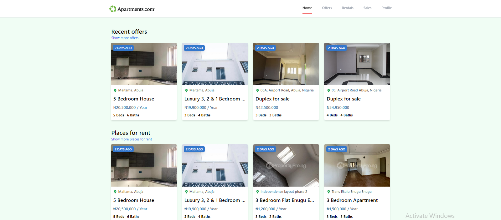

# A Real estate web app

This app lists available properties for rent and sale in Nigera,
 It a beginner friendly project for React.js developers

## Acknowledgements

 - [Dr. Sahand Ghavidel](https://www.youtube.com/channel/UCZiu-e5yvST2RFRPFoR9eYg)

## Appendix

Changes would be added as I pick up more advanced concepts in react

## Badges

Add badges from somewhere like: [shields.io](https://shields.io/)

## Screenshots

